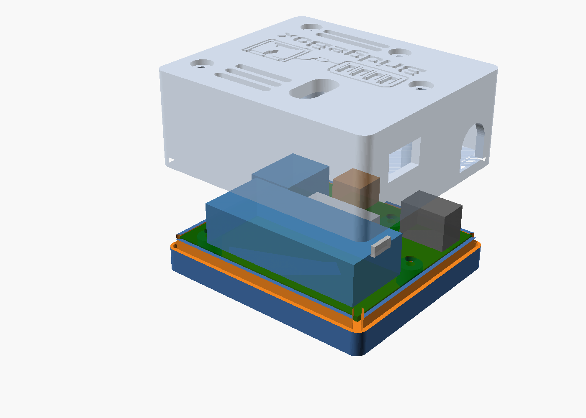
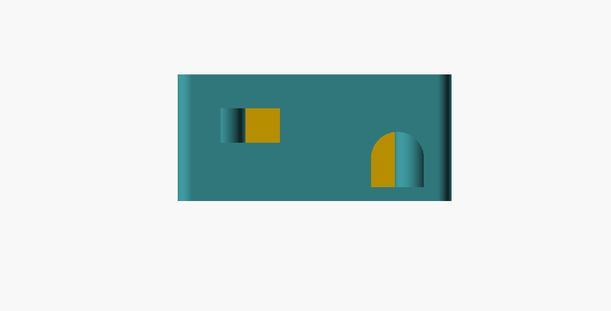
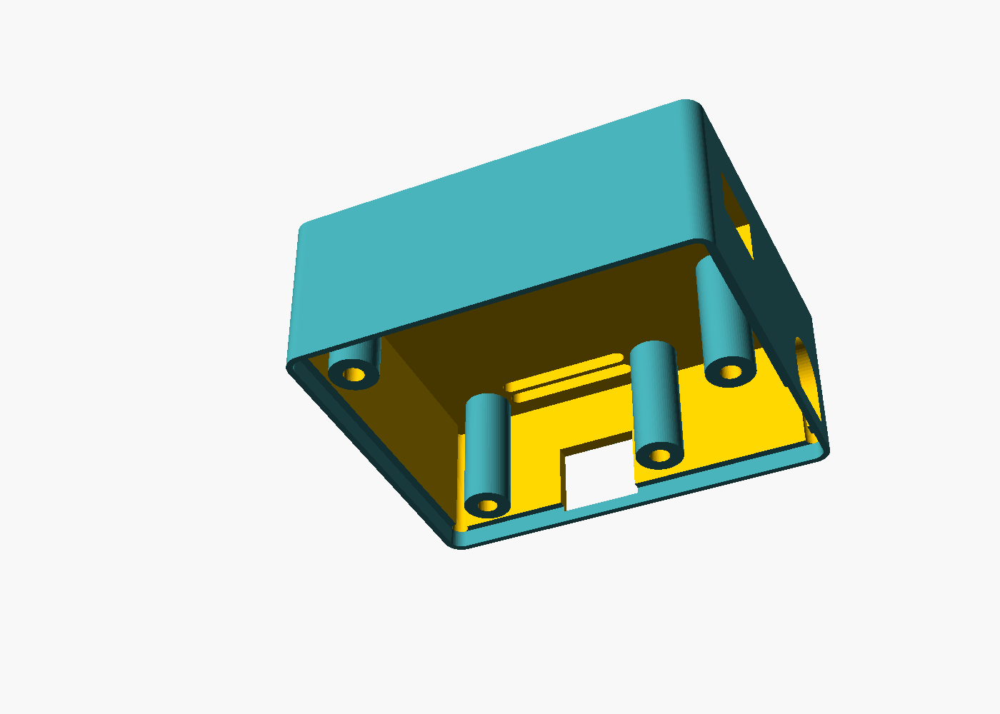

# BridgeBox carrier — printed case

Two parts, four screws, no supports.

|  |  |
|---|---|
| Outside | 68.6 × 59.6 × 34.6 mm |
| Parts | `out/tray.stl`, `out/lid.stl` |
| Hardware | 4 × M3 × 30 (see below) |
| Source | `case.scad` — every dimension is a named constant at the top |



## Why it splits where it does

The split line is the **top face of the PCB**.

This is not a styling choice. The one thing this project has no data for is
height: KiCad footprints are plan views, no 3D models are installed, and the
Pico's height in particular depends on which headers you sit it on — your
choice, not the board's. So rather than guess three component heights and cut
three holes at those heights, the lid ends at the board surface and every
connector opening is a **notch open at the bottom**. A notch whose bottom edge
is the board surface lines up with a connector whose bottom edge is also the
board surface, and it does so whatever the part's height turns out to be. A
guessed height can only make a notch too tall. It can never make it miss.

That is also why the tray prints flat-bottom-down and the lid prints
upside-down: in that orientation neither part has a single overhang, and the
notches become open-topped slots that need no bridging.

## Openings

| Wall | Opening | For |
|---|---|---|
| left | 13 × 13 mm | Pico USB |
| left | 11.5 mm wide, arched over the axis at 6.3 mm | J1 barrel jack |
| front | 13.5 × 11 mm, 1 mm below the board plane | J2 AMS Micro-Fit (drops into the tray wall so the plug fully seats) |
| top | ⌀8 mm slot, ~7 mm long | BOOTSEL (placed for the Pico 2's SW1) |

The BOOTSEL hole is deliberately oversized. A Pico you have to unscrew the case
to flash the first time is a Pico you will unscrew the case to flash, and the
button's exact offset from the USB end is the one Pico dimension worth being
loose about.



## Screws

Four M3 × 25, from the top. Each one goes through the lid, down a column that
lands on the board around its mounting hole, through the board, and into a post
in the tray — so one screw clamps lid, board and tray together and there is
only one size of fastener in the whole thing.

The posts are bored 2.6 mm for a self-tapping M3 into plastic. If you would
rather use heat-set inserts, render with `-D insert=true` and the bore becomes
4.0 × 5.5 mm.

**Length matters in both directions.** Shorter than 28 mm and the screw has
nothing to bite. Longer than 31 mm and it bottoms out in a blind hole and jacks
the lid back off the tray, which feels exactly like a stripped post and is not
one. 30 mm is the standard size in the window. `case.scad` works that size out
from the window rather than naming one, and echoes both on every render, so
changing a height cannot leave the advice pointing at the old screw.



## Printing

| | |
|---|---|
| Orientation | tray: floor down. lid: **top face down**, open side up |
| Supports | none, either part |
| Layer | 0.2 mm |
| Walls | 3 perimeters — the 1.2 mm lap and the 2.3 mm column walls want them |
| Infill | 15 % |

PLA is fine; this sits beside a printer, not in one. The tray's four posts and
the lid's four columns are the only tall thin features and both are solid
annuli, not fins.

## Building it

```sh
./build.sh
```

Renders both STLs and the pictures in this file. It runs `check_case.py` first
and stops if that fails — which is the point of it.

## check_case.py

`case.scad` restates the board: its outline, its four mounting holes, and where
its three connectors sit. Restated numbers rot. Someone nudges a part in
`gen_pcb.py`, the gerbers change, and this quietly becomes a case for the
previous board.

So nothing here trusts `case.scad`. The checker reads the constants back out of
it and tests each one against the placement the PCB is actually generated from:

* outline and mounting holes match `gen_pcb.py` exactly
* every wall opening clears its connector's **body** — F.Fab, not the
  courtyard, because a courtyard runs out to the solder pads and sizing a hole
  in a wall to a solder pad is how you get a hole in a wall that a plug will
  not go through
* every screw column and tray post clears every part on the board, and stays
  inside the board outline
* the BOOTSEL hole lands on the Pico

```
$ python3 check_case.py
...
RESULT: case matches the board
```

## Files

| | |
|---|---|
| `case.scad` | the case. `-D part="tray"` / `"lid"` / `"both"` |
| `preview.scad` | pictures only — the exploded view, with blocks standing in for the parts. Never printed |
| `check_case.py` | the case against the board |
| `build.sh` | check, render, draw |
